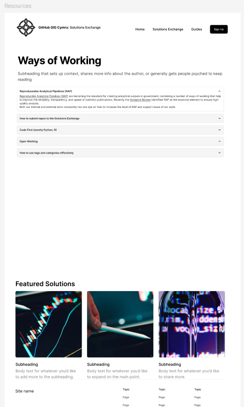

# Getting Started with the GIG Cymru Solutions Exchange

Welcome to the GIG Cymru Solutions Exchange! This guide will help you navigate our automated repository catalogue and start discovering, reusing, and contributing to software solutions across NHS Wales.

## What is the Solutions Exchange?

The GIG Cymru Solutions Exchange is an automated catalogue that displays public and internal repositories from the NHS Wales GitHub Enterprise. Our platform helps developers, IT teams, and project managers discover existing code solutions, collaborate across organizations, and accelerate development through code reuse.

## Key Features

### 🔍 Automated Repository Discovery
Our system automatically pulls repository data from NHS Wales GitHub Enterprise, including:
- Repository name and description
- Programming language and technology stack
- Last updated dates and activity metrics
- Contributor information and collaboration levels
- License information and reuse readiness

### 🏷️ Smart Categorization
Repositories are automatically tagged and categorized based on:
- Keywords in repository names and descriptions
- Programming languages and frameworks
- NHS Wales organizational ownership
- Healthcare use cases and domains

### 📊 Real-Time Updates
The catalogue refreshes automatically on a daily schedule, ensuring you always have access to the latest repository information and updates.

## Quick Start Guide

### For Developers

**1. Search and Discover**  
Use our keyword search to find repositories relevant to your project needs.

**2. Filter by Criteria**  
Narrow down results by:

- Programming language
- Contributing organization
- Repository topics and use cases
- Last updated date
- Reuse readiness level

**3. Evaluate Reuse Potential**  
Review repository metadata including:
- Documentation quality
- License compatibility
- Contributor activity
- Cross-organization collaboration

**4. Connect and Collaborate**  
Reach out to repository maintainers for implementation guidance or to propose contributions.

### For Project Managers

**1. Assess Existing Solutions**  
Before starting new development, search for existing repositories that solve similar problems.

**2. Evaluate Implementation Effort**  
Review repository documentation, reuse readiness levels, and implementation guides.

**3. Plan Collaborative Projects**  
Identify opportunities for cross-organization collaboration and shared development efforts.

**4. Track Technology Adoption**  
Monitor trending technologies and popular solutions across NHS Wales.

### For IT Leaders

**1. Strategic Technology Alignment**  
Identify common technology stacks and platforms used across NHS Wales organizations.

**2. Monitor Code Reuse Metrics**  
Track collaboration levels and code reuse across your organization and others.

**3. Support Collaborative Innovation**  
Encourage teams to contribute to and benefit from shared repositories.

**4. Assess Open Source Adoption**  
Monitor license usage and open source technology adoption.

## Repository Categories

### 🏥 Healthcare Applications
- **Electronic Health Records**: EHR systems, integrations, and enhancements
- **Patient Portals**: Patient-facing applications and mobile solutions
- **Clinical Decision Support**: AI/ML tools for clinical decision making
- **Telehealth Platforms**: Remote care and virtual consultation systems

### 📊 Analytics and Data
- **Population Health**: Public health monitoring and analytics dashboards
- **Clinical Analytics**: Performance metrics and outcome analysis
- **Operational Intelligence**: Hospital operations and resource optimization
- **Research Platforms**: Clinical research and data management tools

### � Security and Infrastructure
- **Cybersecurity Tools**: Healthcare-specific security solutions
- **Infrastructure Automation**: Deployment and configuration management
- **Compliance Frameworks**: Regulatory compliance and audit tools
- **Integration Platforms**: System integration and interoperability solutions

### 🛠️ Development Tools
- **Testing Frameworks**: Healthcare application testing tools
- **CI/CD Pipelines**: Continuous integration and deployment solutions
- **Monitoring Tools**: Application and infrastructure monitoring
- **Documentation Generators**: API documentation and technical writing tools

## Understanding Repository Metadata

### Reuse Readiness Levels
- ⭐⭐⭐⭐⭐ **Production Ready**: Fully documented, tested, deployment-ready
- ⭐⭐⭐⭐ **Ready with Documentation**: Well documented with setup guides
- ⭐⭐⭐ **Beta with Active Development**: Functional but under development
- ⭐⭐ **Early Development**: Basic functionality, limited documentation
- ⭐ **Proof of Concept**: Experimental or demonstration code

### License Information
Understanding repository licenses helps determine reuse potential:
- **MIT/BSD**: Permissive licenses allowing broad reuse
- **Apache-2.0**: Permissive with patent protection
- **GPL**: Copyleft licenses requiring derivative works to use same license
- **Proprietary**: Organization-specific licensing terms

### Collaboration Metrics
- **Contributors**: Number of developers contributing to the repository
- **Organizations**: Number of NHS Wales organizations involved
- **Activity Level**: Frequency of commits and updates
- **Issue Resolution**: Response time for bug reports and feature requests

## Best Practices

### For Repository Discovery
1. **Start with Broad Searches**: Use general terms, then narrow with filters
2. **Check Multiple Organizations**: Similar solutions may exist across health boards
3. **Review Recent Activity**: Active repositories often have better support
4. **Read Documentation**: Evaluate setup complexity and requirements

### for Code Reuse
1. **Understand the License**: Ensure compatibility with your project needs
2. **Contact Maintainers**: Discuss implementation plans and get support
3. **Review Security**: Assess security implications and compliance requirements
4. **Plan for Maintenance**: Consider long-term support and update strategies

### For Contributing
1. **Follow NHS Wales Standards**: Adhere to coding and security standards
2. **Document Thoroughly**: Provide clear setup and usage instructions
3. **Use Descriptive Names**: Help others discover your repository
4. **Add Relevant Topics**: Improve discoverability through proper tagging

## Getting Support

### Developer Community
- **GIG Cymru Developer Network**: Monthly virtual meetups and knowledge sharing
- **Technical Forums**: GitHub Discussions and Teams channels
- **Code Review Sessions**: Peer review and best practice sharing

### Technical Support
- **Platform Issues**: [support@solutions.gig.cymru](mailto:support@solutions.gig.cymru)
- **Repository Questions**: Contact repository maintainers directly
- **Implementation Guidance**: [digital.health@gig.cymru](mailto:digital.health@gig.cymru)

### Training Resources
- **GitHub Enterprise Training**: Getting started with NHS Wales GitHub
- **Code Collaboration Workshops**: Best practices for multi-organization projects
- **Security and Compliance**: Healthcare-specific development guidelines

## Success Metrics

!!! success "Accelerating Development"
    The Solutions Exchange has helped NHS Wales organizations:
    
    - **Avoid 150+ hours** of duplicate development work per month
    - **Identify 50+ reusable solutions** across health boards
    - **Enable 30+ cross-organization collaborations**
    - **Reduce development costs** by an average of 25%

## Next Steps

Ready to explore? Choose your path:

- **[Browse Repository Catalogue](solutions-library.md)**  
  Explore the complete catalogue of NHS Wales GitHub repositories with advanced filtering.

- **[Submit Your Repository](contribution-guide.md)**  
  Share your code solutions to help other NHS Wales organizations benefit from your work.

- **[Join Developer Community](mailto:digital.health@gig.cymru)**  
  Connect with other NHS Wales developers and contribute to collaborative projects.

---

**Ready to accelerate your development?** Start exploring the repository catalogue and discover how NHS Wales organizations are solving similar challenges to yours.
