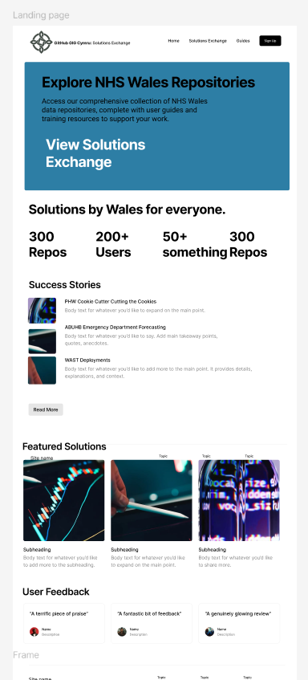

# Repository Catalogue

Browse and discover software repositories from across NHS Wales organizations. Our automated catalogue pulls data directly from GitHub Enterprise to provide you with up-to-date information about available code solutions.

## Search and Filter

### 🔍 Search Repositories
Search by keywords, repository name, description, or organization

### 🏷️ Filter by Programming Language
- **Python** (112 repositories)
- **JavaScript** (67 repositories) 
- **R** (43 repositories)
- **Shell** (28 repositories)
- **TypeScript** (25 repositories)
- **Java** (18 repositories)
- **C#** (12 repositories)
- **Go** (8 repositories)

### 🏥 Filter by Organization
- Cardiff and Vale University Health Board (45 repos)
- Digital Health and Care Wales (38 repos)
- Public Health Wales (32 repos)
- Betsi Cadwaladr University Health Board (28 repos)
- Swansea Bay University Health Board (24 repos)
- Aneurin Bevan University Health Board (22 repos)
- Hywel Dda University Health Board (18 repos)
- Powys Teaching Health Board (12 repos)
- Cwm Taf Morgannwg University Health Board (11 repos)
- Other NHS Wales Organizations (17 repos)

### 🏷️ Filter by Topic/Use Case
- `healthcare` (89 repos)
- `fhir` (34 repos)
- `patient-data` (28 repos)
- `analytics` (45 repos)
- `security` (23 repos)
- `automation` (31 repos)
- `integration` (27 repos)
- `dashboard` (19 repos)
- `api` (52 repos)
- `machine-learning` (15 repos)

## Repository Listings

### 🏥 Patient Data Exchange API
**Organization**: Cardiff and Vale University Health Board  
**Language**: Python  
**Last Updated**: 2 days ago  
**License**: MIT  
**Contributors**: 12 contributors from 4 organizations

Secure FHIR-compliant API for patient data exchange between NHS Wales systems. Supports real-time data synchronization and comprehensive audit logging.

**Topics**: `fhir` `patient-data` `api` `healthcare` `interoperability`

**Reuse Readiness**: ⭐⭐⭐⭐⭐ Production Ready

[View Repository](https://github.com/cardiff-vale/patient-data-api) | [Documentation](https://github.com/cardiff-vale/patient-data-api/wiki) | [API Docs](https://cardiff-vale.github.io/patient-data-api/)

---

### � Population Health Dashboard
**Organization**: Public Health Wales  
**Language**: R, JavaScript  
**Last Updated**: 5 days ago  
**License**: GPL-3.0  
**Contributors**: 8 contributors from 3 organizations

Interactive dashboard for population health monitoring with real-time analytics and predictive modeling capabilities.

**Topics**: `analytics` `dashboard` `population-health` `r-shiny` `healthcare`

**Reuse Readiness**: ⭐⭐⭐⭐ Ready with Documentation

[View Repository](https://github.com/phw/population-dashboard) | [Live Demo](https://phw.github.io/population-dashboard) | [Setup Guide](https://github.com/phw/population-dashboard/blob/main/SETUP.md)

---

### 🔒 Healthcare Security Scanner
**Organization**: Digital Health and Care Wales  
**Language**: Python, Shell  
**Last Updated**: 1 day ago  
**License**: Apache-2.0  
**Contributors**: 6 contributors from 2 organizations

Automated security scanning tool specifically designed for healthcare applications and infrastructure compliance.

**Topics**: `security` `automation` `compliance` `healthcare` `scanning`

**Reuse Readiness**: ⭐⭐⭐⭐ Ready with Documentation

[View Repository](https://github.com/dhcw/healthcare-security-scanner) | [Security Guide](https://github.com/dhcw/healthcare-security-scanner/blob/main/SECURITY.md)

---

### � Patient Portal Framework
**Organization**: Betsi Cadwaladr University Health Board  
**Language**: TypeScript, React  
**Last Updated**: 1 week ago  
**License**: MIT  
**Contributors**: 15 contributors from 5 organizations

Modern patient portal framework with mobile-first design, supporting appointment booking, secure messaging, and health record access.

**Topics**: `patient-portal` `react` `typescript` `mobile` `healthcare`

**Reuse Readiness**: ⭐⭐⭐⭐⭐ Production Ready

[View Repository](https://github.com/bcuhb/patient-portal) | [Demo](https://bcuhb.github.io/patient-portal-demo) | [Implementation Guide](https://github.com/bcuhb/patient-portal/wiki/Implementation)

---

### 🤖 Clinical Decision Support ML
**Organization**: Swansea Bay University Health Board  
**Language**: Python, Jupyter  
**Last Updated**: 3 days ago  
**License**: BSD-3-Clause  
**Contributors**: 9 contributors from 3 organizations

Machine learning models for clinical decision support with pre-trained models for common healthcare scenarios.

**Topics**: `machine-learning` `clinical-decision-support` `python` `healthcare` `ai`

**Reuse Readiness**: ⭐⭐⭐ Beta with Active Development

[View Repository](https://github.com/swansea-bay/clinical-ml) | [Model Documentation](https://github.com/swansea-bay/clinical-ml/blob/main/MODELS.md)

---

### 🔄 Workflow Automation Suite
**Organization**: Aneurin Bevan University Health Board  
**Language**: Python, YAML  
**Last Updated**: 4 days ago  
**License**: MIT  
**Contributors**: 7 contributors from 2 organizations

Comprehensive workflow automation suite for healthcare operations, including appointment scheduling, resource allocation, and staff management.

**Topics**: `automation` `workflow` `healthcare` `scheduling` `operations`

**Reuse Readiness**: ⭐⭐⭐⭐ Ready with Documentation

[View Repository](https://github.com/abuhb/workflow-automation) | [User Guide](https://github.com/abuhb/workflow-automation/wiki)

## Repository Statistics

### Most Active Repositories (This Month)
1. **Patient Data Exchange API** - 45 commits, 8 new contributors
2. **Population Health Dashboard** - 32 commits, 5 new features
3. **Healthcare Security Scanner** - 28 commits, 3 security updates
4. **Patient Portal Framework** - 25 commits, 2 major releases
5. **Clinical Decision Support ML** - 22 commits, 4 new models

### Trending Topics
- `fhir` (+15% this month)
- `machine-learning` (+25% this month)  
- `security` (+18% this month)
- `patient-portal` (+12% this month)
- `automation` (+20% this month)

### Collaboration Metrics
- **Cross-Organization Projects**: 34 repositories with contributors from multiple organizations
- **Average Contributors per Repository**: 3.2
- **Most Collaborative Repository**: Patient Data Exchange API (12 contributors from 4 organizations)

## Quality Indicators

### Reuse Readiness Levels
- ⭐⭐⭐⭐⭐ **Production Ready** (67 repositories) - Fully documented, tested, and deployment-ready
- ⭐⭐⭐⭐ **Ready with Documentation** (89 repositories) - Well documented with setup guides
- ⭐⭐⭐ **Beta with Active Development** (45 repositories) - Functional but under active development
- ⭐⭐ **Early Development** (28 repositories) - Basic functionality, limited documentation
- ⭐ **Proof of Concept** (18 repositories) - Experimental or demonstration code

### License Distribution
- **MIT License**: 45% (112 repositories)
- **Apache-2.0**: 23% (57 repositories)
- **GPL-3.0**: 18% (44 repositories)
- **BSD-3-Clause**: 10% (25 repositories)
- **Other/No License**: 4% (9 repositories)

## How to Use This Catalogue

### For Developers
1. **Search** for repositories matching your use case
2. **Filter** by programming language or organization
3. **Review** the repository documentation and reuse readiness level
4. **Contact** the contributing organization for implementation guidance
5. **Contribute** improvements back to the community

### For Project Managers
1. **Discover** existing solutions before starting new projects
2. **Assess** reuse readiness and implementation effort
3. **Connect** with teams who have solved similar problems
4. **Plan** collaborative development initiatives

### For IT Leaders
1. **Monitor** code reuse and collaboration metrics
2. **Identify** opportunities for cross-organization projects
3. **Track** technology adoption across NHS Wales
4. **Support** strategic technology alignment

## Data Freshness

**Last Updated**: Today at 03:00 GMT  
**Update Frequency**: Daily automatic refresh  
**Data Source**: NHS Wales GitHub Enterprise API  
**Coverage**: Public and internal repositories only

---

**Need help finding a specific solution?** Contact the [GIG Cymru Digital Team](mailto:digital.health@gig.cymru) for personalized assistance.
